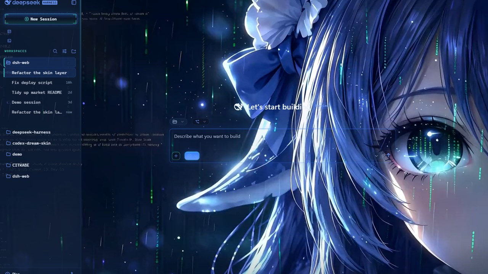

# dsh-skin-whale-fantasy

[](https://awesome-dsh-plugin.com)
[](LICENSE)


[English](README.md) | 中文

把 **鲸鱼娘 · 未至之境（Whale Girl · The Unreached）** 皮肤做成独立 DeepSeek Harness（dsh）插件：启用即应用，禁用即无残留还原。没有皮肤中心、没有设置项、没有皮肤列表——只有主题本身。



## 特性

- **完整的鲸鱼娘皮肤，独立运行**：原版 `skin.css`（L1 token 重映射，95 个 `--dsw-alias-*`）与 `patches.css`（L3 全息氛围层），按皮肤中心运行时相同的方式注入
- **循环鲸鱼背景视频 + 全屏压暗层**：固定背景层（`z-index: -2`，`pointer-events: none`）承载 2.58 秒眨眼循环、0.5 不透明度的深夜蓝黑压暗层与 scrim 渐变，body 背景强制透明让画面透出——压暗层保证透明面板上的文字可读性
- **皮肤中心契约盖章**：插件激活期间设置 `html[data-dsh-skin="whale-fantasy"]`，针对该标记编写的补丁（以及依赖该标记的其他插件）行为完全一致
- **完全自包含，运行时零网络**：样式表与视频在构建期全部内联进 client bundle（视频为 base64，运行时转 blob URL）——无 CDN、无静态资源路由、无全局变量
- **干净卸载**：一切挂在单个 `ctx.effect` 内，禁用插件即摘除全部 DOM 痕迹，body 背景原样恢复

## 安装

本插件为纯浏览器侧呈现，无任何 Host 侧服务依赖。

要求 dsh ≥ 0.1.7-rc.1。

```bash
dsh plugin --profile web add github:jiangwangyang/dsh-skin-whale-fantasy
```

或在 dsh 插件管理器中安装包 `dsh-skin-whale-fantasy`。

## 使用

没有设置开关：插件启用即应用皮肤。

- **关闭**：禁用或卸载插件（`dsh plugin --profile web remove dsh-skin-whale-fantasy`），样式表、盖章、背景层（含压暗层）与 body 透明化全部撤除，默认外观原样恢复
- **外观设置**：**暗色专用**皮肤（原作者设计）——系统在亮色模式下也渲染同一套暗色调色板
- **与皮肤中心互斥**（`@linxin666/dsh-client-ui-skin-center`）：两者都会盖 `data-dsh-skin` 章并占用背景层，二选一使用

## 工作原理

### 整体架构

皮肤为纯浏览器侧呈现：Host 半边是空实现（bundle 加载器要求每行都有 Node 半边），全部逻辑位于单个 client bundle 中：

| 部分       | 位置 | 职责 |
|------------|------|------|
| Host 半边  | `src/index.ts` | 空实现（`apply()` 什么也不做） |
| 客户端     | `src/client/index.ts` | 注入样式表、盖 `data-dsh-skin` 章、挂载背景层（视频 + 压暗层 + scrim 渐变），全部在单个 `ctx.effect` 内 |
| 皮肤资产   | `src/client/skin-assets.ts` | `SKIN_CSS` / `PATCHES_CSS` / `VIDEO_BASE64` / `SCRIM` / `VEIL`，全部内联、随仓库分发；视频为上游 25.5 秒循环裁剪出的无缝 2.58 秒眨眼片段 |

### 激活步骤

一次激活、无切换、无设置——客户端完整复制皮肤中心运行时对这套皮肤做的事：

1. 以 `<style>` 标签向 `document.head` 注入 `skin.css` 与 `patches.css`；
2. 盖上 `html[data-dsh-skin="whale-fantasy"]` 标记——皮肤中心契约；
3. 挂载固定背景层（`z-index: -2`，`pointer-events: none`），内置循环眨眼视频与 scrim 渐变——负 z 位于 html/body 背景之上、所有面板之下；
4. 背景层内嵌全屏压暗层（位于 video 之后、scrim 之前），0.5 不透明度的深夜蓝黑纱均匀压暗画面、保证透明面板上的文字可读性——必须与 video 同处一个层叠上下文，否则视频被合成器提升为独立合成层后会浮到压暗层之上；
5. 把 body 背景强制透明让画面透出（原值被记录，卸载时恢复）。

### 门控与卸载

- 皮肤全部视觉以 `html` 元素上的 `data-dsh-skin` 属性与注入的 `<style>` 标签为门：插件激活时存在，禁用即消失，无残留
- 一切注册在单个 `ctx.effect` 内；卸载时 disposer 按注册逆序执行：移除样式表、移除盖章、暂停视频并回收 blob URL、移除背景层（含压暗层）、恢复 body 背景
- 所有资产（CSS 与视频）均随客户端 bundle 分发，相对 `url()` 解析与网络访问都不是问题；代价是 client bundle 体积较大

### 背景视频

视频位于 `assets/whale-blink-loop.mp4`（base64 内联进 `src/client/skin-assets.ts`），为上游 25.5 秒循环裁剪出的 2.58 秒眨眼片段（第 378-439 帧，15.71 秒–18.29 秒；删除开头线条构建段，剩余眨眼首尾同相位可无缝循环）。上游下载地址：[jsDelivr CDN](https://cdn.jsdelivr.net/gh/zhu1090093659/dsh-web@dev/market/dist/assets/skins/whale-fantasy/assets/whale-fantasy-loop.mp4)（[GitHub raw 备用](https://raw.githubusercontent.com/zhu1090093659/dsh-web/dev/market/dist/assets/skins/whale-fantasy/assets/whale-fantasy-loop.mp4)）。复现命令：

```bash
ffmpeg -ss 15.7083 -i whale-fantasy-loop.mp4 -frames:v 62 \
  -c:v libx264 -crf 19 -preset slow -pix_fmt yuv420p -an \
  -movflags +faststart assets/whale-blink-loop.mp4
```

运行时视频从内联 base64 解码为 blob URL，交给静音、循环、内联播放的 `<video>` 元素（`object-fit: cover`）——不发起任何网络请求。

## 从源码构建

```bash
pnpm install
pnpm build        # 打出 lib/index.js + lib/client.js（资产已随仓库分发，无下载步骤）
```

## 项目结构

```
.
├── cordis.patch.yml      # bundle 补丁：把插件行插入 web 插件名册
├── package.json          # exports、dsh.bundle / dsh.client 清单
├── lib                   # 构建产物（已提交，git 安装无需构建步骤）
├── assets
│   └── whale-blink-loop.mp4   # 裁剪后的背景视频；skin-assets.ts 中 base64 的来源
└── src
    ├── index.ts          # Host 半边（空实现）
    └── client
        ├── index.ts      # 客户端（样式 + 盖章 + 背景层）
        └── skin-assets.ts   # 皮肤资产（CSS + 视频，全部内联）
```

## 署名

皮肤本体——`skin.json` / `skin.css` / `patches.css`、调色板、全部全息化 HUD 规则与背景视频——均为 **stushansusu** 原创，按 [CC BY-NC-SA 4.0](https://creativecommons.org/licenses/by-nc-sa/4.0/) 发布。来源：https://github.com/zhu1090093659/dsh-web/tree/dev/market/dist/assets/skins/whale-fantasy。

## 许可

[CC BY-NC-SA 4.0](./LICENSE)——本包装插件只负责把皮肤打包成可独立安装的形态，同样以该条款发布。
